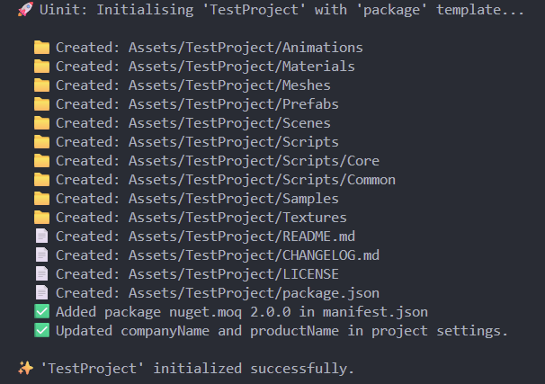

# UInit
Small project to learn Rust and making it faster to start new Unity projects.

Starting a new Unity project means spending a couple hours just organising folders, creating necessary files and fetching dependencies.
The aim of this project is to initialise Unity projects with the core folder structures, assemblies and files I use frequently.



## Features
- Create all necessary folders in one go
- Create package manifest for unity packages quickly - uses Jinja2 templating.
- Create LICENSE files automatically using Jinja2 templating. Currently just works for the BSD 3-clause license.
- Initialise Steamworks dependencies and steam-appid.txt in one command
- Create whole feature domains with runtime, editor, test assemblies with a single command
- Import default or custom modules into your project with a single command. Imports modules as part of your project, not just a package

## Developing
See [DEVELOPING.md](/DEVELOPING.md)

## Getting Started
1. Install the latest version using
```bash
curl --proto '=https' --tlsv1.2 -LsSf https://github.com/ErencanPelin/UInit/releases/download/v0.1.1/uinit-installer.sh | sh
```
2. Run `uinit --help` in your terminal to get started.
3. Update your current version with `uinit-update`

### To setup UInit in your Unity project
```sh
uinit project init --template <GAME | PACKAGE> <PROJECT_NAME>
# e.g. with all optional fields
uinit project init --template package --company ErencanPelin --email myemail@mailserver.com MyNewPackage
```

### To init steam
```sh
uinit steam init --app-id <APP_ID>
# e.g. 480 = Spacewar
uinit steam init --app-id 480
```

### To create a new feature domain
A feature domain lives inside /Scripts. This command creates sub folders for the feature (runtime, editor, tests) as well as the necessary assembly definition files for those sub folders.
```sh
uinit feature create <FEATURE_NAME>
# e.g.
uinit feature create MyNewFeature
```

### To import predefined tool scripts, utils or feature modules
```sh
# list all aliases and their config
uinit alias list

# import a tool/feature/util by its alias
uinit add <ALIAS>
# e.g.
uinit add statemachines
```

### To add or customise your own aliases and point them to your own code
```sh
# add custom alias or alias override
uinit alias add --repo <REPO_HTTP_URL> --path <PATH_TO_MODULE_FROM_REPO_ROOT> --alias-type <UTIL | TOOL | MODULE> <ALIAS_NAME>
# e.g.
uinit alias add --repo https://github.com/ErencanPelin/Unity-Utils --path /Utils/Core --alias-type util core-utils

# remove custom aliases
uinit alias rm <ALIAS_NAME>
# e.g.
uinit alias rm core-utils

# list available aliases
uinit alias list
```